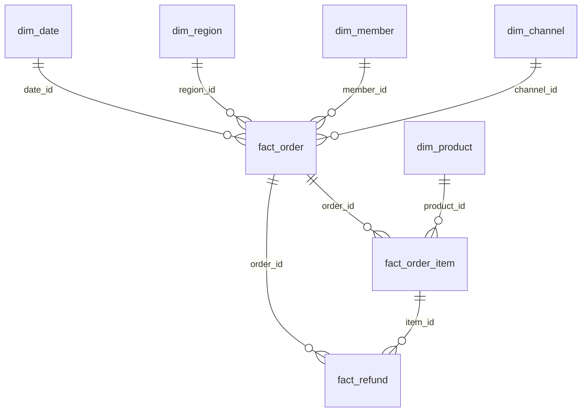

# v2 电商问数数仓设计教学文档

这份文档的目标不是直接给出建表 SQL，而是先帮你理解电商业务场景，再解释为什么 v2 版要这样设计数据库。

读完之后，你应该能回答这些问题：

- 电商系统里一次交易会产生哪些数据。
- 为什么不能只用一张订单表解决所有问数需求。
- 为什么要区分订单事实表、订单明细事实表、退款事实表。
- 为什么问数 Agent 需要指标定义、字段别名、表关系和业务口径。
- v2 数据库应该支持哪些典型问题，为什么这些问题适合拿去面试展示。

## 1. 先理解电商业务

电商最核心的业务很简单：

```text
用户通过某个渠道进入平台，浏览商品，下单购买，支付订单，商家发货，用户可能退款。
```

这一句话里其实包含了很多分析对象：

```text
用户是谁
从哪个渠道来
买了什么商品
在哪个地区下单
什么时候下单
订单金额是多少
买了几件
有没有退款
退款原因是什么
```

问数系统的本质，就是把用户的自然语言问题转成对这些业务对象的统计。

比如：

```text
去年第一季度各地区 GMV 是多少？
```

这个问题背后的业务含义是：

```text
时间范围：去年第一季度
统计对象：订单成交金额
统计维度：地区
指标口径：GMV = 成交金额求和
```

再比如：

```text
退款率最高的商品品类是什么？
```

这个问题背后的业务含义是：

```text
统计对象：商品品类
需要订单数据：有多少订单或明细被购买
需要退款数据：有多少订单或明细发生退款
指标口径：退款率 = 退款数量 / 销售数量，或退款订单数 / 订单数
```

所以，电商问数不是“让大模型随便写 SQL”，而是要让系统理解：

```text
用户说的业务词，对应哪些表、哪些字段、哪些计算公式。
```

## 2. v1 数据为什么不够

当前项目的 v1 数据更像一个教学 Demo，核心表大概是：

```text
fact_order
dim_date
dim_region
dim_product
```

它能回答一些基础问题：

```text
按地区统计 GMV
按月份统计销售额
按品类统计订单金额
```

但如果你想把 askAgent 做深，它会遇到几个问题。

### 2.1 订单和商品明细混在一起

如果只有 `fact_order`，你可能会在订单表里放：

```text
order_id
product_id
order_amount
quantity
```

这样看起来简单，但真实电商里一个订单可能买多个商品。

例如：

```text
订单 O001
  商品 A，买 2 件，金额 100
  商品 B，买 1 件，金额 50
订单总金额 = 150
```

如果一张订单表只存一个 `product_id`，就无法准确表达“一个订单多个商品”的情况。

这会导致一些问题没法可靠回答：

```text
销量最高的商品是什么？
各品类销售额是多少？
某个商品的退款率是多少？
```

所以 v2 需要引入 `fact_order_item`，把订单和商品明细拆开。

### 2.2 没有会员和渠道，分析维度不够

真实电商常问：

```text
不同会员等级的客单价是多少？
直播渠道和自然流量哪个 GMV 更高？
新客和老客消费差异如何？
```

这些问题需要：

```text
dim_member
dim_channel
```

没有会员表和渠道表，系统只能做地区、商品、时间分析，业务深度不够。

### 2.3 没有退款事实，无法分析售后

如果没有退款表，就不能自然回答：

```text
退款金额是多少？
退款率最高的品类是什么？
哪个渠道退款率偏高？
```

退款是电商分析里很常见的经营指标。它可以让你的项目从“查销售额”升级到“分析经营质量”。

## 3. v2 数据库设计目标

v2 不是为了堆很多表，而是为了支持更真实、更适合面试展示的问数场景。

目标是支持这些能力：

```text
销售分析：GMV、订单数、客单价、销量
商品分析：商品销量、品类 GMV、Top 商品
会员分析：会员等级、新老客、支付用户数、人均消费
渠道分析：不同渠道 GMV、订单数、客单价
地区分析：各大区、城市、省份销售表现
退款分析：退款金额、退款订单数、退款率、退款原因
时间分析：按天、月、季度、节假日、去年、近 30 天
```

这个范围刚好适合求职项目：

- 不会复杂到像真实企业数仓那样难维护。
- 又比简单 Demo 更有业务味道。
- 能覆盖 Text2SQL 的常见难点：多表 join、指标口径、时间解析、分组聚合、TopN、过滤条件。

## 4. 推荐的 v2 表结构

建议新开一个数据库，例如：

```text
dw_v2
```

不要直接污染原来的 v1 数据。

v2 建议包含 8 张表：

```text
dim_date          日期维表
dim_region        地区维表
dim_product       商品维表
dim_member        会员维表
dim_channel       渠道维表

fact_order        订单事实表
fact_order_item   订单明细事实表
fact_refund       退款事实表
```

整体关系可以这样理解：



## 5. 什么是维表和事实表

这是理解数仓设计的关键。

### 5.1 事实表

事实表记录业务事件。

电商里的业务事件包括：

```text
用户下了一笔订单
订单里买了某个商品
用户发起了一笔退款
```

所以 v2 里有三张事实表：

```text
fact_order
fact_order_item
fact_refund
```

事实表通常比较大，里面会有金额、数量、状态、外键 ID。

### 5.2 维表

维表描述业务对象的属性。

例如：

```text
日期有什么属性：年份、月份、季度、是否周末
商品有什么属性：品类、品牌、价格带
会员有什么属性：等级、性别、年龄段
渠道有什么属性：App、小程序、直播、广告
地区有什么属性：大区、省份、城市等级
```

所以 v2 里有五张维表：

```text
dim_date
dim_region
dim_product
dim_member
dim_channel
```

维表通常比较小，但非常重要，因为用户问的很多自然语言条件都来自维表。

例如：

```text
华东地区
去年第一季度
高等级会员
直播渠道
服饰品类
```

这些词都不是指标，而是维度条件。

## 6. 每张表为什么需要

### 6.1 dim_date 日期维表

日期维表负责把“时间”结构化。

用户不会总是说精确日期，用户经常说：

```text
去年
今年 3 月
第一季度
近 30 天
周末
双 11
618
春节前
```

如果只有订单日期字段，模型也能写一些 SQL，但稳定性会差。

日期维表可以提供：

```text
date_id
date
year
quarter
month
day
week_of_year
weekday
is_weekend
festival_name
```

这样 Agent 可以把：

```text
去年第一季度
```

稳定转换成：

```sql
dim_date.year = 2025 AND dim_date.quarter = 'Q1'
```

日期维表的意义：

- 降低时间表达解析难度。
- 支持按年、季度、月、周分组。
- 支持节假日分析。
- 让测试集更稳定。

### 6.2 dim_region 地区维表

地区维表负责描述订单发生的地理位置。

用户常问：

```text
各地区 GMV
华东地区销售额
一线城市订单数
广东省销量
```

建议字段：

```text
region_id
region_name
province
city
city_level
```

其中：

```text
region_name：华东、华南、华北、西南、华中
province：广东、浙江、江苏、四川等
city：广州、杭州、南京、成都等
city_level：一线、新一线、二线、三线
```

地区维表的意义：

- 支持按大区、省份、城市分组。
- 支持“华东”“广东”“一线城市”等不同粒度表达。
- 适合造业务规律，比如华东、华南 GMV 更高。

### 6.3 dim_product 商品维表

商品维表负责描述商品属性。

用户常问：

```text
哪个商品销量最高？
各品类 GMV 排名？
服饰类退款率是多少？
高价商品卖得怎么样？
```

建议字段：

```text
product_id
product_name
category_l1
category_l2
brand
price_band
list_price
```

其中：

```text
category_l1：服饰、数码、食品、美妆、家居
category_l2：女装、手机、零食、护肤、收纳
brand：品牌
price_band：低价、中价、高价
```

商品维表的意义：

- 支持商品、品类、品牌分析。
- 支持 TopN 问题。
- 支持后续分析“高价商品 GMV 高但销量低”。
- 支持退款率按品类分析。

### 6.4 dim_member 会员维表

会员维表负责描述用户。

用户常问：

```text
不同会员等级 GMV 是多少？
高等级会员客单价是不是更高？
新客订单数是多少？
支付用户数是多少？
```

建议字段：

```text
member_id
member_level
gender
age_band
register_date
is_new_member
```

其中：

```text
member_level：普通、银卡、金卡、铂金
age_band：18-24、25-34、35-44、45+
is_new_member：是否新会员
```

会员维表的意义：

- 支持用户分层分析。
- 支持支付用户数、人均消费。
- 支持更真实的经营分析。
- 可以造出“会员等级越高，客单价越高”的规律。

### 6.5 dim_channel 渠道维表

渠道维表负责描述订单来源。

用户常问：

```text
各渠道 GMV 是多少？
直播渠道订单数最高吗？
自然流量和广告渠道客单价差异？
哪个渠道退款率最高？
```

建议字段：

```text
channel_id
channel_name
channel_type
```

其中：

```text
channel_name：App、小程序、直播、搜索广告、自然流量、社群
channel_type：自有渠道、付费渠道、内容渠道、私域渠道
```

渠道维表的意义：

- 支持渠道经营分析。
- 可以造出“直播销量高但退款率偏高”的业务规律。
- 适合后续做轻量分析总结。

### 6.6 fact_order 订单事实表

订单事实表是一张“订单粒度”的事实表。

一行代表一笔订单。

适合回答：

```text
订单数是多少？
GMV 是多少？
客单价是多少？
支付用户数是多少？
各地区销售额是多少？
各渠道 GMV 是多少？
```

建议字段：

```text
order_id
date_id
member_id
region_id
channel_id
order_status
order_amount
discount_amount
pay_amount
shipping_amount
```

字段解释：

```text
order_amount：订单原始金额，可理解为 GMV
discount_amount：优惠金额
pay_amount：用户实际支付金额
order_status：paid、shipped、completed、refunded、cancelled
```

为什么订单表不直接放商品品类？

因为一笔订单可能包含多个商品。订单表只负责订单整体，不负责商品明细。

### 6.7 fact_order_item 订单明细事实表

订单明细事实表是一张“商品明细粒度”的事实表。

一行代表一笔订单中的一个商品。

例如：

```text
订单 O001 买了 2 件商品 A
订单 O001 买了 1 件商品 B
```

这会产生两行订单明细。

适合回答：

```text
哪个商品销量最高？
各品类销售额是多少？
各品牌销量是多少？
高价商品 GMV 是多少？
```

建议字段：

```text
item_id
order_id
product_id
quantity
item_amount
discount_amount
pay_amount
cost_amount
```

字段解释：

```text
quantity：购买件数
item_amount：该商品明细原始金额
pay_amount：该商品明细实际支付金额
cost_amount：成本金额，可用于毛利分析
```

为什么这张表很重要？

因为“销量”和“订单数”不是一回事。

```text
订单数：有多少笔订单
销量：卖出了多少件商品
```

如果用户问：

```text
去年第一季度销量最高的商品
```

应该用：

```sql
SUM(fact_order_item.quantity)
```

而不是：

```sql
COUNT(fact_order.order_id)
```

这正是问数系统容易出错的地方。

### 6.8 fact_refund 退款事实表

退款事实表记录退款事件。

一行代表一次退款。

适合回答：

```text
退款金额是多少？
退款订单数是多少？
退款率是多少？
退款率最高的品类是什么？
哪个渠道退款率最高？
```

建议字段：

```text
refund_id
order_id
item_id
date_id
refund_amount
refund_quantity
refund_reason
refund_status
```

字段解释：

```text
refund_amount：退款金额
refund_quantity：退款件数
refund_reason：质量问题、尺码不合适、七天无理由、物流慢
refund_status：success、processing、rejected
```

退款表的意义：

- 支持经营质量分析。
- 让项目不只会查销售额。
- 可以设计“服饰类退款率较高”“直播渠道退款率偏高”等业务规律。

## 7. 核心指标设计

问数系统里，指标定义比表结构更重要。

因为用户通常不会说字段名，用户会说业务词。

例如：

```text
销售额
成交额
GMV
订单量
销量
客单价
退款率
```

这些词必须被映射成稳定 SQL。

建议 v2 至少支持这些指标：

| 指标 | 业务含义 | 推荐 SQL 口径 | 常见别名 |
| --- | --- | --- | --- |
| GMV | 成交总额 | `SUM(fact_order.order_amount)` | 销售额、成交额、订单金额 |
| 支付金额 | 用户实际支付金额 | `SUM(fact_order.pay_amount)` | 实付金额、支付总额 |
| 订单数 | 订单数量 | `COUNT(DISTINCT fact_order.order_id)` | 订单量、下单数 |
| 销量 | 商品销售件数 | `SUM(fact_order_item.quantity)` | 销售件数、售出数量 |
| 客单价 | 每单平均金额 | `GMV / 订单数` | 平均订单金额、AOV |
| 支付用户数 | 下单用户数 | `COUNT(DISTINCT fact_order.member_id)` | 购买用户数 |
| 人均消费 | 每个支付用户平均消费 | `GMV / 支付用户数` | ARPPU、客均消费 |
| 退款金额 | 成功退款金额 | `SUM(fact_refund.refund_amount)` | 售后金额 |
| 退款订单数 | 发生退款的订单数 | `COUNT(DISTINCT fact_refund.order_id)` | 售后订单数 |
| 退款率 | 退款订单数占订单数比例 | `退款订单数 / 订单数` | 售后率 |

这里有一个很重要的区别：

```text
销售额 / GMV：金额类指标，用 SUM(金额)
订单数 / 订单量：订单类指标，用 COUNT(DISTINCT order_id)
销量 / 销售件数：商品件数类指标，用 SUM(quantity)
```

之前你遇到过“销售数据量”被生成成 `SUM(order_amount)` 的问题。这个问题的根源就是业务词没有定义清楚。

在 v2 中，你应该明确告诉系统：

```text
如果用户说销售额、成交额、GMV，使用金额。
如果用户说订单数、订单量，使用订单计数。
如果用户说销量、销售件数、售出数量，使用商品件数。
如果用户说销售数据量，这个词不明确，优先追问或根据上下文判断。
```

## 8. 典型问数场景

v2 数据库应该能覆盖这些问题。

### 8.1 基础聚合

```text
统计去年第一季度 GMV
统计 2025 年 3 月订单数
查询近 30 天销量
```

考察能力：

```text
时间解析
指标识别
单指标聚合
```

### 8.2 分组统计

```text
统计去年第一季度各地区 GMV
按会员等级统计客单价
按渠道统计订单数和 GMV
```

考察能力：

```text
维度识别
GROUP BY
多表 JOIN
```

### 8.3 TopN 排名

```text
查询 GMV 最高的前 5 个商品
找出退款率最高的 3 个品类
统计订单数最高的前 5 个渠道
```

考察能力：

```text
ORDER BY
LIMIT
指标计算
商品和退款表关联
```

### 8.4 多指标

```text
按地区统计 GMV、订单数和客单价
统计各渠道的订单数、支付用户数、人均消费
查询各品类销量、GMV 和退款率
```

考察能力：

```text
多个指标同时生成
不同指标依赖不同事实表
聚合口径一致
```

### 8.5 经营分析

```text
分析去年第一季度各渠道销售情况
分析华东地区 GMV 为什么高
找出退款率异常高的品类
```

这类问题不是单纯查表，而是：

```text
先查数
再基于查询结果生成业务解读
```

这正好能接到你后续的 `data_analysis` 能力。

## 9. 造数据时要故意设计业务规律

如果数据完全随机，问数结果会很无聊，也不适合做分析。

v2 数据应该故意包含一些合理规律。

### 9.1 地区规律

可以设计：

```text
华东、华南订单量更高
华北中等
西南、华中略低
一线城市客单价更高
```

这样问：

```text
为什么华东 GMV 最高？
```

系统可以分析：

```text
华东订单数高，且客单价也偏高。
```

### 9.2 时间规律

可以设计：

```text
618、双11销售峰值明显
春节前食品和礼品类增长
周末订单略高
月底促销订单增加
```

这样问：

```text
2025 年 6 月 GMV 为什么高？
```

系统可以关联 618 活动。

### 9.3 商品规律

可以设计：

```text
食品销量高但客单价低
数码销量低但 GMV 高
服饰退款率高
美妆复购较高
家居客单价中等
```

这样问：

```text
哪个品类最值得关注？
```

系统可以结合 GMV、销量、退款率分析。

### 9.4 会员规律

可以设计：

```text
普通会员数量最多
金卡、铂金会员客单价更高
新会员订单数高但复购少
老会员人均消费更稳定
```

这样问：

```text
不同会员等级消费差异如何？
```

系统会有真实差异可解释。

### 9.5 渠道规律

可以设计：

```text
App GMV 稳定
直播渠道销量高但退款率高
搜索广告获客多但客单价低
社群渠道客单价高
自然流量退款率低
```

这样问：

```text
哪个渠道质量最好？
```

系统可以不只看 GMV，还看退款率和客单价。

## 10. v2 对 askAgent 的价值

v2 数据库不是孤立的，它是为了让 askAgent 更有深度。

### 10.1 让字段召回更真实

用户说：

```text
高等级会员
直播渠道
服饰品类
退款率
```

系统应该召回：

```text
dim_member.member_level
dim_channel.channel_name
dim_product.category_l1
fact_refund.refund_amount
```

这能检验向量召回、字段别名和元数据描述是否有效。

### 10.2 让指标召回更有意义

v1 只有 GMV、AOV，指标太少。

v2 可以扩展到：

```text
GMV
订单数
销量
客单价
支付用户数
人均消费
退款金额
退款率
```

这样用户问题更丰富，指标召回才有挑战。

### 10.3 让 SQL 生成更接近真实场景

v2 会出现更多真实 SQL 难点：

```text
订单表 join 日期表、地区表、会员表、渠道表
订单明细表 join 商品表
退款表 join 订单表和商品表
多指标聚合
TopN
复杂分组
```

这比单表或两三张表的 Demo 更适合面试讲。

### 10.4 让评测更有说服力

你可以设计评测集覆盖：

```text
时间解析正确率
字段召回正确率
指标召回正确率
SQL 执行成功率
结果正确率
修正成功率
安全拦截成功率
```

这会让项目从“功能展示”变成“有工程评估”。

## 11. v2 设计边界

虽然 v2 要更真实，但不要过度复杂。

暂时不要做：

```text
库存表
物流表
优惠券核销表
曝光点击流量表
搜索行为表
客服售后工单表
```

这些都是真实电商会有的数据，但对当前求职项目来说会分散重点。

当前目标是：

```text
把交易、商品、会员、渠道、退款这条主线讲清楚。
```

等 askAgent 问数稳定后，再考虑加流量表，支持：

```text
曝光
点击
转化率
点击率
加购率
```

但这应该是下一阶段，不是 v2 的第一版。

## 12. 推荐的实施顺序

### 第一步：先定数据库名

建议：

```text
dw_v2
```

保留旧的 `dw` 或 v1 数据，不直接覆盖。

### 第二步：定表结构

先写设计文档或 SQL 草稿，明确：

```text
每张表的字段
每张事实表的粒度
每张表的主键
表之间的关联字段
```

尤其要明确事实表粒度：

```text
fact_order：一行一笔订单
fact_order_item：一行一个订单商品明细
fact_refund：一行一次退款
```

### 第三步：定指标口径

先不要造数据，先把指标定义清楚：

```text
GMV 怎么算
订单数怎么算
销量怎么算
客单价怎么算
退款率怎么算
支付用户数怎么算
```

指标定义会直接影响 `meta_config.yaml` 和提示词。

### 第四步：设计造数规则

写清楚数据规律：

```text
地区差异
时间峰值
会员差异
渠道差异
品类退款差异
```

不要纯随机。

### 第五步：写建表和造数脚本

建议文件：

```text
scripts/v2/init_dw_v2_schema.sql
scripts/v2/seed_dw_v2_data.py
```

### 第六步：更新元数据配置

更新：

```text
conf/meta_config.yaml
```

或新建：

```text
conf/meta_config_v2.yaml
```

我更建议先新建 `meta_config_v2.yaml`，等验证稳定后再替换默认配置。

### 第七步：构建评测集

建议新建：

```text
docs/v2_question_eval_set.md
```

记录 30 条问题和预期。

## 13. 面试时怎么讲这套设计

你可以这样讲：

```text
原项目只有一个比较简单的电商问数 Demo，我二次开发时发现它能回答基础 GMV 查询，但对真实电商场景中的商品明细、会员分层、渠道分析和退款分析支持不足。

所以我重新设计了一套 v2 小型电商数仓，采用维度表和事实表建模。事实表拆成订单、订单明细和退款三类，分别支撑 GMV、销量、退款率等不同指标。维表包括日期、地区、商品、会员和渠道，用来支撑用户自然语言里的时间、地域、品类、会员等级和渠道条件。

在这套数据基础上，我扩展了指标语义层和元数据配置，让 askAgent 不只是生成 SQL，而是能基于业务指标口径、字段别名和表关系进行问数，并通过 SQL 校验、自修复和评测集提高稳定性。
```

这段话的重点是：

```text
你不是单纯加表。
你是在根据问数系统的能力边界反推业务数据建模。
```

这就是项目深度。

## 14. 最后的设计原则

v2 设计时记住这几句话：

```text
表结构服务于问题，不是表越多越好。
指标定义比字段数量更重要。
订单数、销量、GMV 是三种不同口径。
订单表解决订单粒度问题，订单明细表解决商品粒度问题。
退款表让系统能分析经营质量。
维表让自然语言里的业务条件有地方落。
造数据必须有业务规律，否则分析能力没有意义。
```

如果你能把这些讲清楚，v2 数据库设计就不是“为了扩展而扩展”，而是有明确业务目标和工程目标的二次开发。
